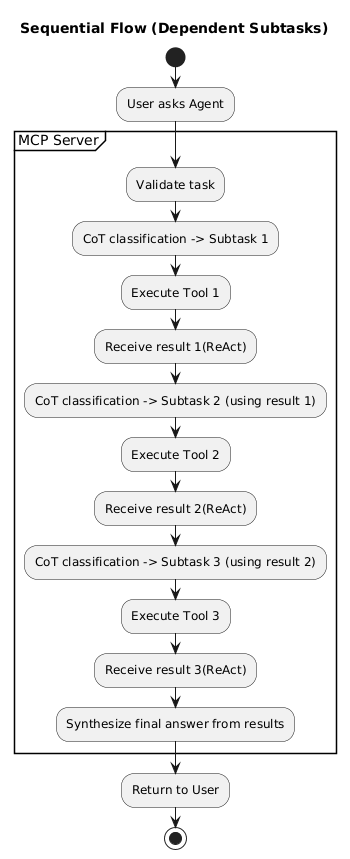
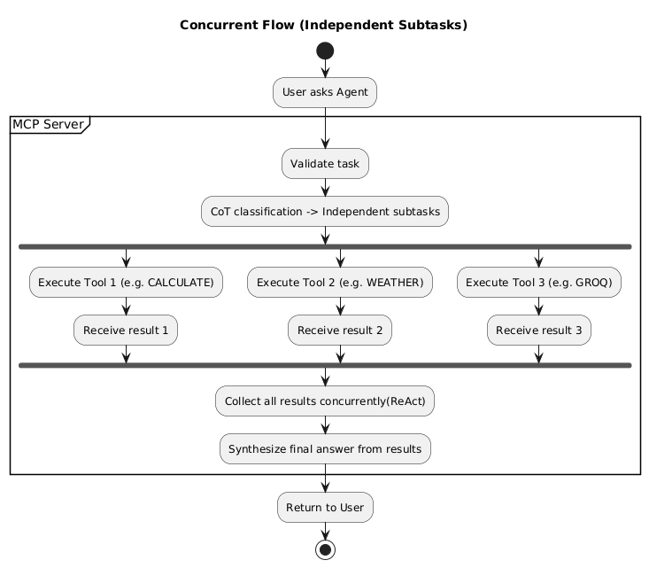

# Agentic-MCP-Server

# MCP Flow

Here’s the overall MCP flow:

---

## Sequential Dependent Flow

---

## Concurrent Independent Flow

##Scaling:
1.) Asychronous execution of tools in case of independedent tasks
2.) Making each tool its own microservice(will be called through API), and make the mcp server just a coordinator rather than being a compute-heavy resource and also tools can be scaled independently
3.) Persistent storage of tasks state input output should be stored, maybe in Redis(as it allows caching by LRU),it helps in recovery in cases of crash and its a general good practice to handle huge traffic of users with different agent states.

##Step by step for scaling
Step-by-step:

User sends a task → MCP server

MCP decides subtasks → puts them in async queue

Tool workers execute subtasks → save results in persistent store

MCP collects results → creates final answer

MCP sends answer back to the user

